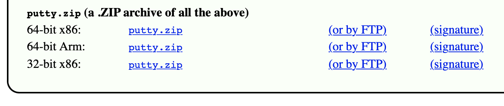
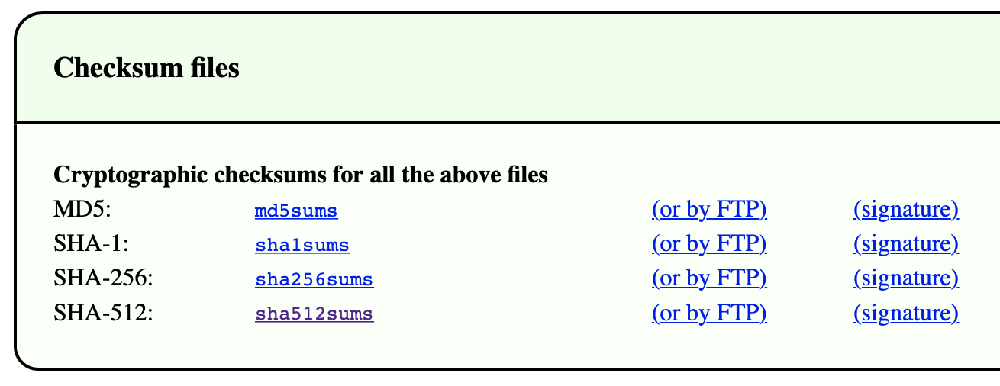

 Arbeitsbericht

- **Name:** Leah Petereder
- **Klasse:** 3AHITS
- **Datum:** 12.5.2026
- **Fach:** SYTB
- **Thema:** Download mit automatisierter Hash/Checksum Überprüfung

---
## Inhaltsverzeichnis
```
1. Übung (Secure Download)
2. Übung (Digitale Signatur prüfen)
```

## 1. Übung (Secure Download)

**PuTTY ist als SSH Client für Windows sehr beliebt. Genauso beliebt ist aber auch einen Trojaner in einem PuTTY Download zu verstecken. Um das zu verhindern werden Downloads gerne mit einem Hashwert (in diesem Zusammenhang auch Checksum genannt) abgesichert.**

- **Schreibe ein Script das einen Download der `64-bit x86` Variante von `putty.zip` durchführt. Webseite von PuTTY.**



- **Gleichzeitig soll die Datei mit den SHA-512 checksums geladen werden. Diese sind ganz am Ende der Seite. Die passende Zeile im File `sha512sums` ist mit `w64/putty.zip` am Ende gekennzeichnet.**



**Im Script soll automatisiert geprüft werden ob die Checksum (=SHA-512 Hash) des geladenen Files mit der Checksum aus dem Checksumfile übereinstimmt. Also zum Beispiel eine Ausgabe kommen: `HASH OK`.**

- **Das Script erwartet lediglich `putty.zip` im gleichen Directory**
- **Das checksum file soll das Script live von der PuTTY Seite laden und im `/tmp` Directory ablegen. Das Script erzeugt dafür mit `mktemp` ein Unterverzeichnis. Alle Zwischenergebnisse sollen ebenfalls in diesem temp directory abgelegt werden.**

**Eine Liste aller u.U. brauchbarer Tools:**

- **`curl -O` – zum Download**
- **`grep` – um die passende Zeile aus dem Checksum-File zu filtern**
- **`cut` – um den SHA-512 aus der Zeile zu extrahieren**
- **`openssl` – um den SHA-512 Hash von `putty.zip` zu rechnen**
- **`xxd` – ist nicht für das Script notwendig sondern fürs debugging der Zwischenergebnisse**
- **`tr – tr -d [:space:]` entfernt evtl. enthalten Leerzeichen und Zeilenumbrüche**
- **`cmp` – zum Vergleich der Hashwerte**
- **`if` – das Ergebnis von cmp auswerten**

---

Zuerst erstellt man ein neues Verzeichnis mit `mkdir securedownload` und wechselt dann auch in dieses Verzeichnis mit `cd securedownload`.

Daraufhin schreibt man dann ein Skript `secure_download.sh` mit dem Inhalt:
```
#!/bin/bash

TMPDIR=$(mktemp -d)

PUTTY_URL="https://the.earth.li/~sgtatham/putty/latest/w64/putty.zip"
SHA_URL="https://the.earth.li/~sgtatham/putty/latest/sha512sums"

if [ ! -f "putty.zip" ]; then
    echo "putty.zip wird heruntergeladen..."
    curl -L -o putty.zip "$PUTTY_URL"
fi

curl -L -o "$TMPDIR/sha512sums" "$SHA_URL"

grep "w64/putty.zip$" "$TMPDIR/sha512sums" > "$TMPDIR/line.txt"

cut -d ' ' -f1 "$TMPDIR/line.txt" | tr -d '[:space:]' > "$TMPDIR/hash_expected.txt"

openssl dgst -sha512 putty.zip | cut -d '=' -f2 | tr -d '[:space:]' > "$TMPDIR/hash_actual.txt"

if cmp -s "$TMPDIR/hash_expected.txt" "$TMPDIR/hash_actual.txt"; then
    echo "HASH OK"
else
    echo "HASH FEHLER"
fi

rm -r "$TMPDIR"
```

Hier wird mit `mktemp` erstmal ein Ordner für Zwischendateien erstellt, danach wird mit geschaut ob es nicht schon eine putty datei gibt und wenn nicht wird mit`curl` die Putty Datei herunhtergeladen. Danach wird die Datei mit Checksum heruntergeladen, wobei dann mit `grep` die passende Zeile für `w64/putty.zip`gesucht und mit `cut` dann nur der Hashwert herausgefiltert wird. Anschließend wird mit `openssl` der Hash der Datei berechnet und mit `cmp` werden dann die Hashwerte miteinander verglichen. Danach wird entweder `HASH OK` oder `HASH FEHLER`.

Danach muss man die Datei wieder mit `chmod +x secure_download.sh` ausführbar machen und dann auch mit `./secure_download.sh` ausfühern.
```
┌──(kali㉿kali)-[~/securedownload]
└─$ ./secure_download.sh
putty.zip wird heruntergeladen...
  % Total    % Received % Xferd  Average Speed   Time    Time     Time  Current
                                 Dload  Upload   Total   Spent    Left  Speed
  0     0    0     0    0     0      0      0 --:--:-- --:--:-- --:--:--     100   342  100   342    0     0   2784      0 --:--:-- --:--:-- --:--:--  2803
 31 3998k   31 1273k    0     0  3457k      0  0:00:01 --:--:--  0:00:01 3457100 3998k  100 3998k    0     0  6602k      0 --:--:-- --:--:-- --:--:-- 11.2M
  % Total    % Received % Xferd  Average Speed   Time    Time     Time  Current
                                 Dload  Upload   Total   Spent    Left  Speed
  0     0    0     0    0     0      0      0 --:--:-- --:--:-- --:--:--     100   339  100   339    0     0   2726      0 --:--:-- --:--:-- --:--:--  2733
100 26626  100 26626    0     0   142k      0 --:--:-- --:--:-- --:--:--  142k
HASH OK
```
Also passt es.

## 2. Übung (Digitale Signatur prüfen)

**PuTTY Downloads sind durch eine digitale Signatur gegen Veränderungen geschützt. Erweitere dein Script so, dass die Signatur des `sha512sums` Files auf Echtheit überprüft wird. Die digitale Signatur des Files wird als zusätzlicher Downloadlink angeboten.**

---

Also wir müssen die Skript Datei `secure_downlad.sh` erweitern:
```
#!/bin/bash

TMPDIR=$(mktemp -d)

PUTTY_URL="https://the.earth.li/~sgtatham/putty/latest/w64/putty.zip"
SHA_URL="https://the.earth.li/~sgtatham/putty/latest/sha512sums"
SIG_URL="https://the.earth.li/~sgtatham/putty/latest/sha512sums.gpg"
KEY_URL="https://www.chiark.greenend.org.uk/~sgtatham/putty/keys/release-2023.asc"

if [ ! -f "putty.zip" ]; then
    echo "putty.zip wird heruntergeladen..."
    curl -L -o putty.zip "$PUTTY_URL"
fi

curl -L -o "$TMPDIR/sha512sums" "$SHA_URL"

curl -L -o "$TMPDIR/sha512sums.gpg" "$SIG_URL"

curl -L -o "$TMPDIR/release-2023.asc" "$KEY_URL"

gpg --import "$TMPDIR/release-2023.asc"

if gpg --verify "$TMPDIR/sha512sums.gpg"
then
    echo "SIGNATUR OK"
else
    echo "SIGNATUR FEHLER"
    rm -r "$TMPDIR"
    exit 1
fi

grep "w64/putty.zip$" "$TMPDIR/sha512sums" > "$TMPDIR/line.txt"

cut -d ' ' -f1 "$TMPDIR/line.txt" | tr -d '[:space:]' > "$TMPDIR/hash_expected.txt"

openssl dgst -sha512 putty.zip | cut -d '=' -f2 | tr -d '[:space:]' > "$TMPDIR/hash_actual.txt"

if cmp -s "$TMPDIR/hash_expected.txt" "$TMPDIR/hash_actual.txt"
then
    echo "HASH OK"
else
    echo "HASH FEHLER"
fi

rm -r "$TMPDIR"
```
Das ursprüngliche Skript wurde um eine digitale Signaturprüfung erweitert. Dafür wurden zuerst zwei neue URLs hinzugefügt: eine für die Signaturdatei `sha512sums.gpg` und eine für den öffentlichen PuTTY Release-Key `release-2023.asc`, danach werden diese Dateien mit `curl` heruntergeladen.

Mit `gpg --import` wird der öffentliche Schlüssel importiert, daraufhin wird mit `gpg --verify` überprüft, ob die Datei `sha512sums.gpg` eine gültige Signatur besitzt. Wenn die Signatur korrekt ist, gibt das Script `SIGNATUR OK` aus, andernfalls `SIGNATUR FEHLER` und das Skript wird beendet. 

Erst danach wird wie schon vorher der SHA-512 Hash von putty.zip berechnet und mit der offiziellen Checksum verglichen.

Wenn man die Datei jetzt ausführt kommt diese Ausgabe:
```
┌──(kali㉿kali)-[~/securedownload]
└─$ ./secure_download.sh       
  % Total    % Received % Xferd  Average Speed   Time    Time     Time  Current
                                 Dload  Upload   Total   Spent    Left  Speed
  0     0    0     0    0     0      0      0 --:--:-- --:--:-- --:--:--     100   339  100   339    0     0   2492      0 --:--:-- --:--:-- --:--:--  2511
100 26626  100 26626    0     0   132k      0 --:--:-- --:--:-- --:--:--  132k
  % Total    % Received % Xferd  Average Speed   Time    Time     Time  Current
                                 Dload  Upload   Total   Spent    Left  Speed
  0     0    0     0    0     0      0      0 --:--:-- --:--:-- --:--:--     100   343  100   343    0     0   2674      0 --:--:-- --:--:-- --:--:--  2679
100 27334  100 27334    0     0   138k      0 --:--:-- --:--:-- --:--:--  138k
  % Total    % Received % Xferd  Average Speed   Time    Time     Time  Current
                                 Dload  Upload   Total   Spent    Left  Speed
  0     0    0     0    0     0      0      0 --:--:-- --:--:-- --:--:--       0     0    0     0    0     0      0      0 --:--:-- --:--:-- --:--:--     100  2090  100  2090    0     0   2164      0 --:--:-- --:--:-- --:--:--  2163
gpg: key 1993D21BCAD1AA77: 1 signature not checked due to a missing key
gpg: /home/kali/.gnupg/trustdb.gpg: trustdb created
gpg: key 1993D21BCAD1AA77: public key "PuTTY Releases <putty@projects.tartarus.org>" imported
gpg: Total number processed: 1
gpg:               imported: 1
gpg: no ultimately trusted keys found
gpg: Signature made Sat 08 Feb 2025 11:29:13 AM CET
gpg:                using RSA key F412BA3AA30FDC0E77B4E3871993D21BCAD1AA77
gpg: Good signature from "PuTTY Releases <putty@projects.tartarus.org>" [unknown]
gpg: WARNING: This key is not certified with a trusted signature!
gpg:          There is no indication that the signature belongs to the owner.
Primary key fingerprint: F412 BA3A A30F DC0E 77B4  E387 1993 D21B CAD1 AA77
SIGNATUR OK
HASH OK
```